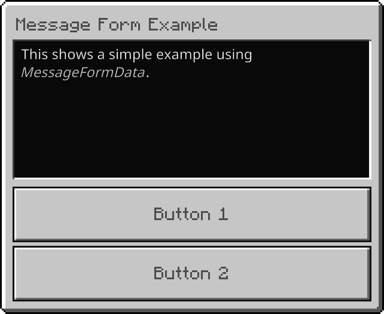
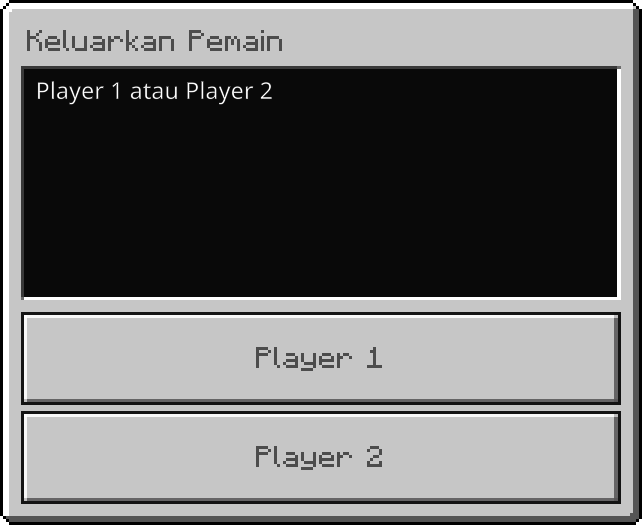

# PMServerUI Example

This plugin is a simple example that shows how to use my [PMServerUI](https://github.com/DavyCraft648/PMServerUI)
virion. The PMServerUI virion is designed to make the old FormAPI better by using the powerful UI features from the
Minecraft Bedrock Script API.

To run this plugin, compile it with a virion compiler tool such as [pharynx](https://github.com/SOF3/pharynx). The tool
shall scan virions from the [`composer.json`](composer.json) automatically and install them.

## Commands

- `/uitest` - Show a list of examples that can be viewed.

  

  ```php
  ActionFormData::create()
      ->title("Form Example")
      ->body("Select example:")
      ->button("showActionForm")
      ->button("showBasicMessageForm")
      ->button("showTranslatedMessageForm")
      ->button("showBasicModalForm")

      ->show($player)->then(function(Player $player, ActionFormResponse $response){
          if($response->canceled || $response->selection === null){
              return;
          }
          $this->showForm($player, (string) $response->selection);
      });
  ```

- `/uitest showActionForm` - Shows a very basic action form.

  

  ```php
  $form = ActionFormData::create()
      ->title("Test Title")
      ->body("Body text here!")
      ->button("Button 1")
      ->header("Header")
      ->divider()
      ->button("Button with local image", "textures/ui/icon_bell")
      ->label("Label")
      ->divider()
      ->button("Another button", "https://github.com/Mojang/bedrock-samples/blob/main/resource_pack/textures/ui/Add-Ons_Nav_Icon36x36.png?raw=true", "url");

  $form->show($player)
      ->then(function(Player $player, ActionFormResponse $result): void{
          if($result->canceled){
              $player->sendMessage("Player exited out of the dialog. Note that if the chat window is up, dialogs are automatically canceled.");
          }else{
              $player->sendMessage("Your result was: " . $result->selection);
          }
      })
      ->catch(function(\Throwable $t): void{
          $this->getLogger()->notice("Hey!! {$t->getMessage()}");
      });
  ```

- `/uitest showBasicMessageForm` - Shows an example two-button dialog.

  

  ```php
  $messageForm = MessageFormData::create()
      ->title("Message Form Example")
      ->body("This shows a simple example using §o§7MessageFormData§r.")
      ->button1("Button 1")
      ->button2("Button 2");

  $messageForm->show($player)
      ->then(function(Player $player, MessageFormResponse $formData): void{
          // player canceled the form, or another dialog was up and open.
          if($formData->canceled || $formData->selection === null){
              return;
          }

          $player->sendMessage("You selected " . ($formData->selection === 0 ? "Button 1" : "Button 2"));
      })
      ->catch(function(\Throwable $t): void{
          $this->getLogger()->notice("Failed to show form: " . $t->getMessage());
      });
  ```

- `/uitest showTranslatedMessageForm` - Shows an example translated two-button dialog.

  Indonesia (Indonesia)

  

  English (United States)

  

  ```php
  $messageForm = MessageFormData::create()
      ->title(new Translatable("permissions.removeplayer"))
      ->body(new Translatable("accessibility.list.or.two", ["Player 1", "Player 2"]))
      ->button1("Player 1")
      ->button2("Player 2");
  
  $messageForm->show($player)
      ->then(function(Player $player, MessageFormResponse $formData): void{
          // player canceled the form, or another dialog was up and open.
          if($formData->canceled || $formData->selection === null){
              return;
          }
  
          $player->sendMessage("You selected " . ($formData->selection === 0 ? "Player 1" : "Player 2"));
      })
      ->catch(function(\Throwable $t): void{
          $this->getLogger()->notice("Failed to show form: " . $t->getMessage());
      });
  ```

- `/uitest showBasicModalForm` - Shows an example multiple-control modal dialog.

  

  ```php
  $modalForm = ModalFormData::create()->title("Example Modal Controls for §o§7ModalFormData§r");
  
  $modalForm->toggle("Toggle");
  $modalForm->toggle("Toggle, default", default: true);
  $modalForm->toggle("Toggle, default, tooltip", default: true, tooltip: "Hovered");
  
  $modalForm->header("Header");
  $modalForm->divider();
  
  $modalForm->slider("Slider", 0, 50);
  $modalForm->slider("Slider, custom step", 0, 50, step: 5);
  $modalForm->slider("Slider, default, custom step", 0, 50, step: 5, default: 30);
  $modalForm->slider("Slider, default, tooltip, custom step", 0, 50, step: 5, default: 30, tooltip: "Hi");
  
  $modalForm->label("hi!!");
  $modalForm->divider();
  
  $modalForm->dropdown("Dropdown", ["option 1", "option 2", "option 3"]);
  $modalForm->dropdown("Dropdown, tooltip", ["option 1", "option 2", "option 3"], tooltip: "Cool");
  $modalForm->dropdown("Dropdown, default", ["option 1", "option 2", "option 3"], default: 2);
  
  $modalForm->divider();
  
  $modalForm->textField("Input");
  $modalForm->textField("Input", "type text here");
  $modalForm->textField("Input, default", "type text here", default: "this is default");
  $modalForm->textField("Input, default, tooltip", "type text here", default: "this is default", tooltip: "Lorem ipsum dolor sit amet, consectetur adipisicing elit, sed do eiusmod tempor incididunt ut labore et dolore magna aliqua.");
  
  $modalForm->submitButton("Send ^-^");
  
  $modalForm->show($player)
      ->then(function(Player $player, ModalFormResponse $formData): void{
          $player->sendMessage("Modal form results: " . json_encode($formData->formValues, JSON_UNESCAPED_SLASHES, 2));
      })
      ->catch(function(\Throwable $t): void{
          $this->getLogger()->notice("Failed to show form: {$t->getMessage()}");
      });
  ```

## Chat message

- `ui test` - Check how the client behaves when sent a form while opening the chat ui.
- `ui test2` - Show the form to the player and try again if the player still has the chat open.